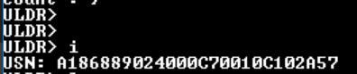
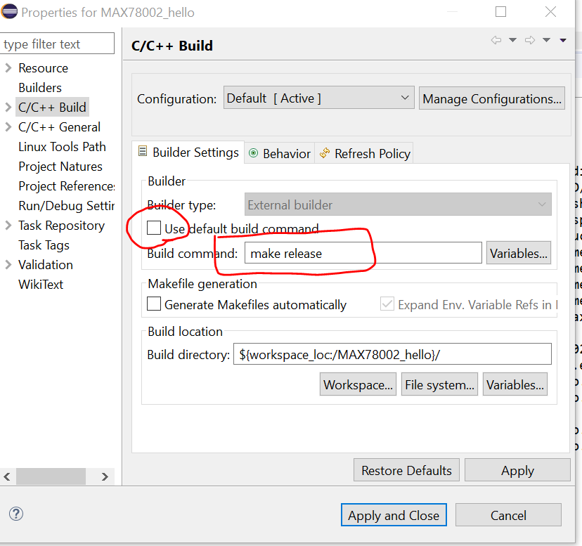
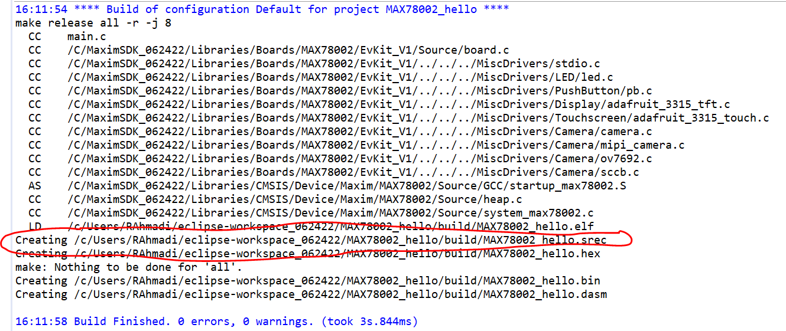
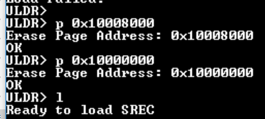
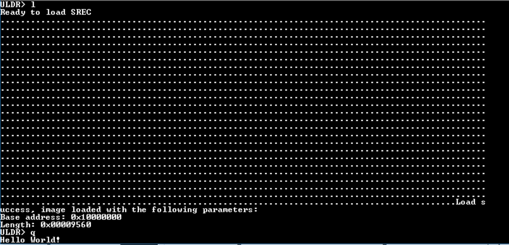

# MAX78000 and MAX78002 Internal Bootloader - Quick Start Guide

MAX78000 and MAX78002 have a built-in, permanent bootloader that allows low level communication with a host.

This bootloader can be used to load firmware through a simple serial interface either by another System-On-Chip (SOC) or a PC. This feature can be very useful for over-the-air (OTA) updates. Refer to the [MAX78000 User Guide](https://www.analog.com/media/en/technical-documentation/user-guides/max78000-user-guide.pdf) for a complete list of commands and detailed descriptions of the internal bootloader.

## Prerequisites

Access to the following pins is necessary in order to use the internal bootloader:

```bash
P0.29
P0.0
RSTIN
```

## How to use the internal bootloader to load firmware

The following steps explain the process on the EVKITs:

1. Turn on the board and make sure the `USB -> serial` is functional by opening a serial terminal window on the virtual comport.

2. Turn off the board and make sure the SWD cable is disconnected from the board.

3. Turn on the board and connect `P0.29` and `P0.0` to `GND`.

4. Press the reset button on the board and release it. You should see a prompt (`ULDR>`) from the bootloader on the serial port. Disconnect both `P0.29` and `P0.0` from `GND`.

5. At this stage you may want to test communication by typing **"i"** in the terminal followed by **Enter**. The part should respond by sending its unique serial number (USN) as shown below.
    

6. The internal bootloader only accepts files in `.srec` format, but [MaximSDK](https://www.analog.com/en/design-center/evaluation-hardware-and-software/software/software-download.html?swpart=sfw0010820a) does **not** generate this format by default; SREC has to be explicitly enabled.
   - *For Eclipse users*: Right-click on the **project** and select **properties**. Under the C/C++ build option, un-click the box shown and type  `make release`. Hit **Apply** and rebuild your project. 
   Make sure that the `.srec` file is built by looking at the Eclipse output.
   - *For Command-line users*: Simply add `release` to the command line.

        ```bash
        $ make release
        ...
        ```

7. You need to know the size of your code in order to know how many flash pages you have to erase. In the case of the example below there are two pages.

8. Once the pages are erased, type **"l"** for load and the bootloader prompts you for the SREC file. 

9. You may drag and drop the SREC file if your terminal application allows it, and it should start loading the code: 

10. When finished, type **"q"** to exit the bootloader. The new code should execute immediately.
